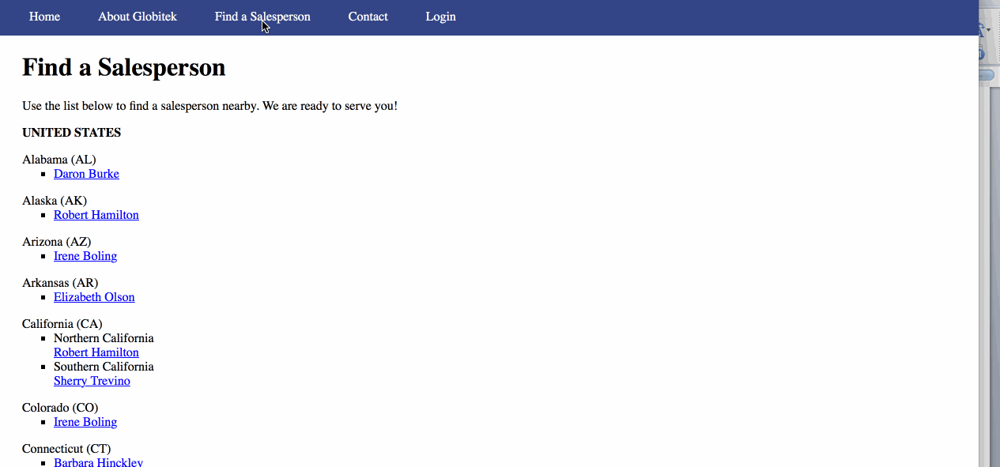
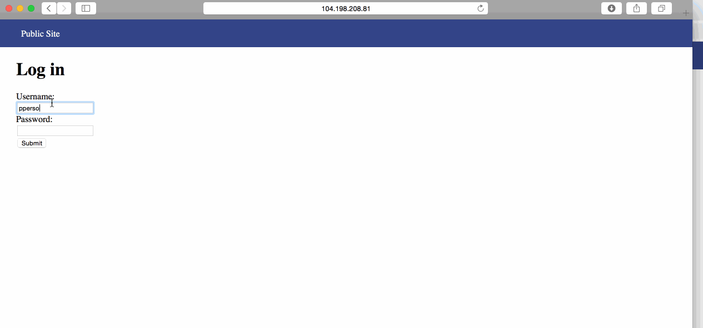
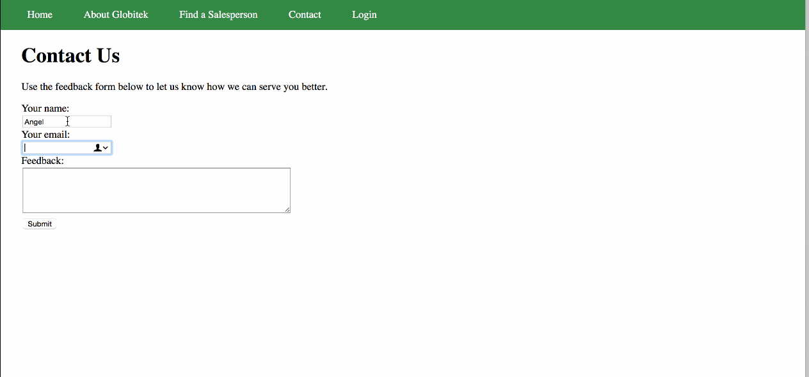
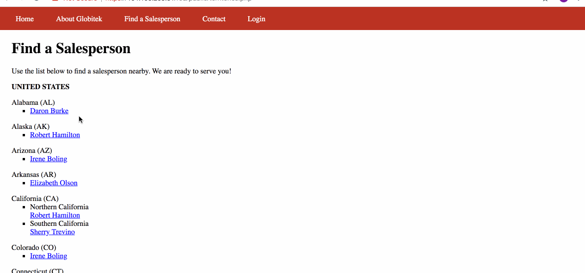
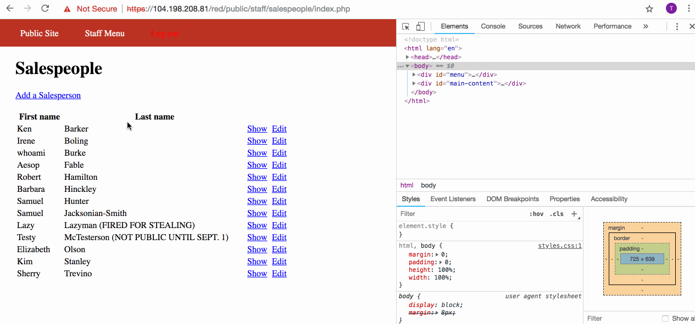

# Project 8 - Pentesting Live Targets

Time spent: **6** hours spent in total

> Objective: Identify vulnerabilities in three different versions of the Globitek website: blue, green, and red.

The six possible exploits are:
* Username Enumeration
* Insecure Direct Object Reference (IDOR)
* SQL Injection (SQLi)
* Cross-Site Scripting (XSS)
* Cross-Site Request Forgery (CSRF)
* Session Hijacking/Fixation

Each version of the site has been given two of the six vulnerabilities. (In other words, all six of the exploits should be assignable to one of the sites.)

## Blue

Vulnerability #1: SQL Injection (SQLi)

On the ‘Find a Salesperson’ page, click on a random salesperson and it’ll direct you to a page with the URL where id = a number that represents that salesperson. We can inject a SQL Injection where id=’’.  By setting id = ‘ OR SLEEP(5)=0--‘ we force the request sent to pause for 5 seconds before it can be fully process. 

Vulnerability #2: Session HiJacking/Fixation

I used two different web browsers. Chrome is used as the attacker and safari is used as the target. I performed a session hijacking by logging into the target browser and obtaining the session id through the hackertool provided. Then I opened the same site on Safari and used the session ID tool once more, but now replacing it with the logged-in session ID from the attacker. 

## Green

Vulnerability #1: User Enumeration

Using the list of users (obtained once we’ve logged in) we can try every username and see what mistake the developer has made. When an unsuccessful password attempt is made, we are provided with the feedback ‘log in was unsuccessful.’ However, for one username the feedback is not bolded while the feedback for the other ones are bolded. If the username does exist (i.e. pperson) then the feedback is bolded but if the username does not exist then the feedback is not bolded.

Vulnerability #2: Cross-Site Scripting (XSS)

Go to the ‘Contact Us’ page and submit a feedback. Copy and paste the script provided by CodePath. Then login with the pperson user name and password. Go to feedback and the script should be executed.

## Red

Vulnerability #1: Insecure Direct Object Reference (IDOR)

We can take advantage of the IDOR vulnerability which exists in the url where the identifier ID will direct us to a salesperson. By guessing and trying the ID numbers (in increasing order from 1) I found two salesperson which seem to contain sensitive information (with ID 10 and 11).  The other two sites prevented this information leak by redirecting unavailable IDs back to its main salesperson page. 

Vulnerability #2: Cross-Site Request Forgery (CSRF)

The red site does not have CSRF protections. Thus, when we change the CSRF value on the edit page we are able to take advantage of a user’s access to change a salesperson’s data. I changed the user Ken Barker to Kennnn Barker on the red site after manipulating the CSRF value. But for the blue site i’m unable to do this, it tells me that it is an invalid request.

## Notes

Describe any challenges encountered while doing the work

